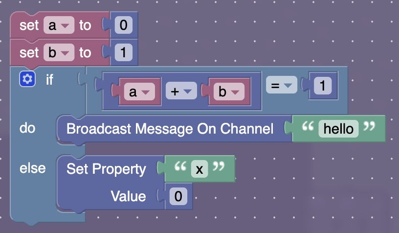

# Gimblocks

Converts JavaScript code to Gimkit's Blockly blocks.

## Why

Although Gimkit's blocks are easily understandable, they're cumbersome to work with for long scripts. Gimblocks allows you to write code in JavaScript and convert it to blocks, which makes scripts:

- faster to write
- faster to edit
- easily reusable across projects
- easier to test by just running the JavaScript, especially if you write some JavaScript code simulating Gimkit-specific functions

## Installation

```bash
npm i github:Ashwagandhae/gimblocks
```

## Example

### Untyped

```javascript
import { jsToBlocks } from 'gimblocks';

function run(d) {
  let a = 0;
  let b = 1;
  if (a + b == 1) {
    d.broadcastMessageOnChannel('hello');
  } else {
    d.setPropertyValue('x', 0);
  }
}

let blocks = jsToBlocks(run.toString());

console.log(JSON.stringify(blocks));
```

### Typed

```javascript
// @ts-check

/**
 * @typedef {import('gimblocks/device').Union} Union
 */

import { jsToBlocks } from 'gimblocks';

// The Union device type is the union of the blocks of all devices.
// More constrained, device-specific types (e.g. Trigger, Text)
// will be supported in the future.
/**
 * @param {Union} d
 */
function run(d) {
  let a = 0;
  let b = 1;
  if (a + b == 1) {
    d.broadcastMessageOnChannel('hello');
  } else {
    d.setPropertyValue('x', 0);
  }
}

let blocks = jsToBlocks(run.toString());

console.log(JSON.stringify(blocks));
```

Outputs JSON representation of Blockly blocks:

```json
{
  "blocks": {
    "languageVersion": 0,
    "blocks": [
      {
        "id": "4p>&;(,d_z8B%?kJ?3@:",
        "type": "variables_set",
        "fields": { "VAR": { "id": "3?ODmCNf_f%<FpM\\RT3Q" } },
        "inputs": {
          "VALUE": {
            "block": {
              "id": "0s\"=q&)3L#]dnZu(uO6l",
              "type": "math_number",
              "fields": { "NUM": 0 }
            }
          }
        },
        "next": { ... }
      }
    ]
  },
  "variables": [
    { "name": "a", "id": "3?ODmCNf_f%<FpM\\RT3Q" },
    { "name": "b", "id": "+mv}y0>c}A3H2('Ou/PR" }
  ]
}
```

These can be injected into Gimkit's Blockly editor with a tool like [BlockConverter](https://github.com/Ashwagandhae/gimkit-block-converter), creating these blocks:


